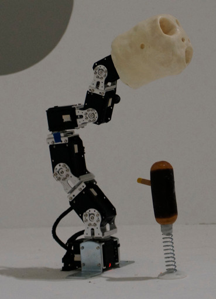

.. _quickstart:

QuickStart: playing with an Ergo-Robot
======================================

To let you discover what you can do with pypot, in this section we describe the few steps required to make a robot build from robotis motor dance. This short introduction will in particular describe you:

* how to define your robot within the software,
* how to connect it to your computer,
* and finally how to control it.

We have developed in our team the Ergo-Robot as a way to explore large scale long term robotic experiments outside of the lab and we have made the whole hardware and software architecture available publicly in an open-source manner so that other research team in the world can use it and leverage our efforts for their own research. As a consequence, you can easily build your own Ergo-Robot.

In this Quick Start, we will use this robot as a base and thus assume that you are using such a robot. Obviously, you can transpose all the following examples to any particular robot made from robotis motor.

Building your own Ergo-Robot
----------------------------

Ergo-Robots have been developed for an art exhibition in Fondation Cartier: `Mathematics a beautiful elsewhere <http://fondation.cartier.com/en/art-contemporain/26/exhibitions/294/all-the-exhibitions/89/mathematics-a-beautiful-elsewhere/>`__. They are small creatures made from robotis motors and shaped as a stem with a head designed by David Lynch. They were developed to explore research topics such as artificial curiosity and language games. The robots were used during 5 months at the exhibition. More details on the whole project can be found `here <https://www.poppy-project.org/project/mathematics-a-beautiful-elsewhere>`__.

The complete instructions to build your own Ergo-Robot are available `here <https://wiki.bordeaux.inria.fr/flowers/doku.php?id=robot:ergorobot:construction>`__.

Connecting the robot to your computer
-------------------------------------

Now that you have your own robot, let's start writing the code necessary to control it.

The first step is to setup the configuration for your robot. It will describe the motor configuration of your robot, the USB2serial controller used and make the initialization really easy. Configurations are described as Python dictionaries. Yet, they can be quite repetitive to write. Luckily, the pypot package comes with an example of a configuration for an Ergo-Robot. You can first import it, so you can modify it::

    from pypot.robot.config import ergo_robot_config

If you do some introspection on this object, you will see that it is just a regular Python dictionary. So you can directly edit it like you will do with any other dict. You can also copy the one provided with pypot and work with your own copy::

    my_config = dict(ergo_robot_config)
    my_config['controllers']['my_dxl_controller']['port']  = 'COM6' # For Windows' users

You will only have to modify the USB2serial port and the id of the motors so they correspond to your robot. If you do not know how to get this information, you can refer to the documentation on the :ref:`Herborist tool <herborist>`. Alternatively, you can directly ask pypot::

    import pypot.dynamixel

    print(pypot.dynamixel.get_available_ports())
    ['/dev/tty.usbserial-A4008aCD', '/dev/tty.usbmodemfd1311']

    dxl_io = pypot.dynamixel.DxlIO('/dev/tty.usbserial-A4008aCD')
    print(dxl_io.scan())
    [11, 12, 13, 14, 15, 16]

.. note:: You can save/load configurations from any format that can be written/read as a Python dictionary. A wrapper for loading json configuration file is provided (see :func:`~pypot.robot.config.from_json`).

.. note:: Since pypot 1.7, you can now set the port to 'auto' in the dictionary. When loading the configuration, pypot will automatically try to find the port with the corresponding attached motor ids.
    For instance::

        my_config = dict(ergo_robot_config)
        my_config['controllers']['my_dxl_controller']['port']  = 'auto'

Once you have edited the configuration dictionary, you should be able to instantiate your robot directly like this::

    import pypot.robot

    ergo_robot = pypot.robot.from_config(my_config)

At this point, if you have not seen any errors it means that you are successfully connected to your robot! You can find details on how to write more complex configuration file in the :ref:`config_file` section.

.. _dance_:

Controlling your Ergo-Robot
---------------------------

Now that you are connected to your Ergo-Robot, let's write a very simple program to make it dance a bit.

First, write the following lines to start you robot (we assume that you have correctly setup your configuration)::

    import pypot.robot

    ergo_robot = pypot.robot.from_config(my_config)

Everything should be clear now. When creating your robot, it automatically starts the synchronization between the "software" robot and the real one, i.e. all commands that you will send in python code will automatically be sent to the physical Ergo-Robot (for details on the underlying mechanisms, see :ref:`Sync Loop <sync_loop>`).

Now, we are going to put the robot in its initial position::

    for m in ergo_robot.motors:
        m.compliant = False

        # Go to the position 0 within 2 seconds.
        # Note that the position is expressed in degrees.
        m.goto_position(0, 2)

The robot should raise and smoothly go to its base position. Now, we are going to move it to a more stable position. We will use it as a rest position for our dance::

    rest_pos = {'base_tilt_lower': 45,
                'base_tilt_upper': -45,
                'head_tilt_lower': 30,
                'head_tilt_upper': -30}

    # You can directly set new positions to motors by providing
    # the Robot goto_position method with a dictionary such as
    # {motor_name: position, motor_name: position...}
    ergo_robot.goto_position(rest_pos, duration=1, wait=True)

We will now create a very simple dance just by applying two sinus with opposite phases on the base and head motors of the robot::

    import numpy
    import time

    amp = 30
    freq = 0.5

    # As you can notice, property to access the motors defined
    # in the configuration file are automatically created.
    ergo_robot.base_pan.moving_speed = 0 # 0 corresponds to the max speed
    ergo_robot.head_pan.moving_speed = 0

    t0 = time.time()
    while True:
        t = time.time() - t0
        if t > 10:
            break

        x = amp * numpy.sin(2 * numpy.pi * freq * t)
        ergo_robot.base_pan.goal_position = x
        ergo_robot.head_pan.goal_position = -x

        time.sleep(0.02)

Your robot should start dancing for ten seconds. Now, that you have seen the very basic things that you can do with pypot. It is time to jump on the :ref:`tutorial <tutorial>` to get a complete overview of the possibility.
